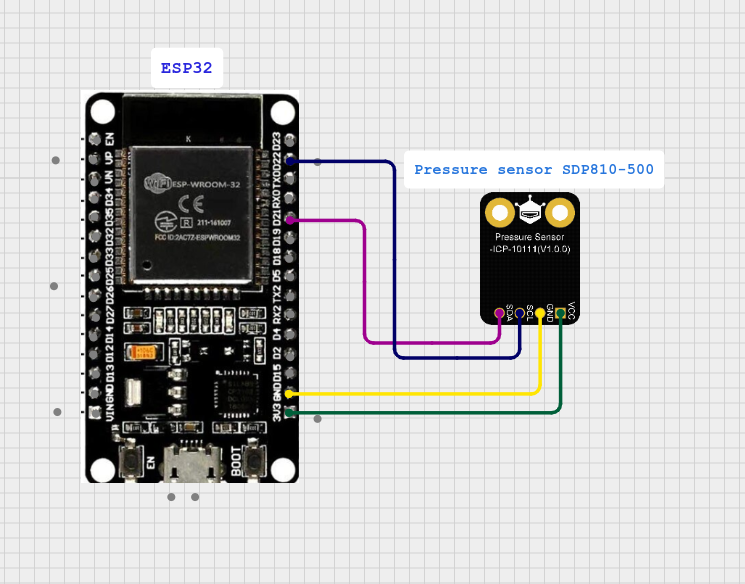

<h1>HVAC Filter Clogging Detection System</h1>
<h2>ESP32 + Sensirion SDP810-500 Differential Pressure Sensor 
Modbus TCP Slave + MQTT Publisher for Home Assistant</h2> 

<h2>📌 Overview</h2>
This project provides a practical solution for detecting <b>HVAC air filter clogging</b> using an <b>ESP32</b> microcontroller and a <b>Sensirion SDP810-500</b> differential pressure sensor.
By measuring the pressure <b>before</b> and <b>after</b> the air filter, the system determines the pressure drop (ΔP). As the filter becomes dirty, air flow decreases → pressure drop increases → the system detects clogging.

This project exposes measured data via <b>two simultaneous interfaces:</b>

✅ <b>Modbus TCP Slave</b> — allowing any BAS/BMS controller to poll the device 
✅ <b>MQTT Publisher</b> — reporting data to <b>Home Assistant</b> or any MQTT broker

The ESP32 works as:
<ul>
  <li><b>I²C master</b> for the SDP810-500 sensor</li>
  <li><b>Modbus slave device</b> on port 502</li>
  <li><b>MQTT sensor publisher</b></li>
  <li><b>Wi-Fi client</b></li>
</ul>

You can test Modbus functionality using <b>Modpoll</b> or any Modbus TCP client.

 

<h2>Circuit</h2>

 

<h2>🛠 Features</h2>
<h3>✅ Differential Pressure Monitoring</h3>
<ul>
  <li>Uses <b>SDP810-500</b> for accurate low-range differential pressure readings</li>
  <li>Calculates pressure difference and outputs values in Pascals</li>
  <li>Includes CRC validation according to Sensirion protocol</li>
</ul>

<h3>✅ Modbus TCP Slave</h3>
<ul>
  <li>Slave address: 1</li>
  <li>Default port: 502</li>
  <li>Exposes holding registers containing sensor data</li>
  <li>Pollable from software like Modpoll, PLCs, BAS controllers, etc.</li>
</ul> 

<b>Registers map:</b>
<table>
  <tr>
    <th>Register</th>
    <th>Meaning</th>
    <th>Notes</th>
  </tr>
  <tr>
    <td>40001 (index 0)</td>
    <td>Differential Pressure (Pa)</td>
    <td>raw_dp/60 scaling</td>
  </tr>
  <tr>
    <td>40002 (index 1)</td>
    <td>Temperature (°C)</td>
    <td>raw_temp/200 scaling</td>
  </tr>
</table> 

<h3>✅ MQTT Publishing</h3>

Publishes real-time pressure values to a Home Assistant MQTT broker: 
<b>Topic:</b>
<code>homeassistant/sensor/pressure</code>

<h3>✅ Wi-Fi Support</h3>
<ul>
  <li>Connects to local network</li>
  <li>Automatically reconnects if connection drops</li>
  <li>MQTT starts only after Wi-Fi IP assignment</li>
</ul>

 

<h2>🧰 Hardware Requirements</h2>
<ul>
  <li><b>ESP32</b> development board</li>
  <li><b>Sensirion SDP810-500PA</b> differential pressure sensor</li>
  <li>3.3V power supply</li>
  <li>HVAC duct with two pressure sampling points</li>
  <li>Tubing for connecting sensor ports</li>
</ul> 

<h3>Wiring (ESP32 → SDP810-500)</h3>
<table>
<tr>
  <th>ESP32 Pin</th>	<th>SDP810 Pin</th>	<th>Description</th>
</tr>
<tr>
  <td>3.3V</td>
  <td>VDD</td>
  <td>Power</td>
</tr>
<tr>
  <td>GND</td>
  <td>GND</td>
  <td>Ground</td>
</tr>
<tr>
  <td>GPIO21</td>
  <td>SDA</td>
  <td>I²C Data</td>
</tr>
<tr>
  <td>GPIO22</td>
  <td>SCL</td>
  <td>I²C Clock</td>
</tr>
</table>
 

<h2>🔧 Software & Libraries</h2>
This project is written fully in <b>ESP-IDF</b>, using the following components:
<ul>
  <li><code>esp_wifi</code> — Wi-Fi STA mode</li>
  <li><code>esp_event, esp_netif</code></li>
  <li><code>esp_modbus_slave</code> — official ESP-IDF Modbus controller</li>
  <li><code>esp_mqtt_client</code> — MQTT client</li>
  <li><code>driver/i2c.h</code> — I²C driver for the SDP810 sensor</li>
  <li>CRC8 implementation (Sensirion polynomial 0x31)</li>
</ul>
 

<h2>📡 Data Flow</h2>
<h3>1. Sensor Acquisition</h3>
ESP32 sends <b>continuous measurement command</b> to SDP810 using I²C. 
Data is read every 2 seconds and validated with CRC checks.

<h3>2. Modbus Publishing</h3>
Converted measurements are stored in the holding registers array. 
Modbus controllers poll the registers over TCP. 

<h3>3. MQTT Publishing</h3>
Pressure value is formatted as a string and sent to the MQTT broker. 
Compatible with Home Assistant auto-discovery.
 

<h2>🧪 Testing Modbus with Modpoll</h2>
Example command:  
<code>modpoll -m tcp -t 4:int -r 1 -c 2 192.168.x.x</code>  
This reads registers 40001–40002 from the ESP32.
 

<h2>▶️ How It Works in HVAC Systems</h2>
<ol>
  <li><b>Pressure tube A</b> connects to duct <b>before</b> the filter</li>
  <li><b>Pressure tube B</b> connects to duct <b>after</b> the filter</li>
  <li>Clean filter → low pressure difference</li>
  <li>Dirty filter → ΔP rises significantly</li>
  <li>ESP32 reads ΔP and makes it available to:</li>
  <ul>
    <li>Home Assistant</li>
    <li>Any Modbus poller</li>
  </ul>
  <li>Automations can notify you when ΔP exceeds thresholds</li>
</ol>
